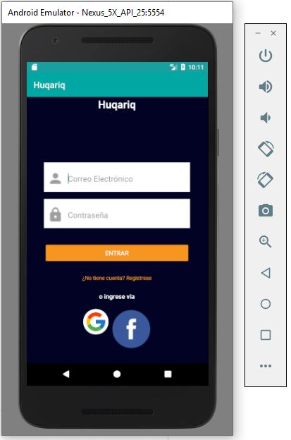

# HuqariqApp TTS

Huqariq TTS es una aplicación mobile open-source para reproducción de voces en quechua. Huqariq esta desarrollo enteramente en Android y permite la creación de speech-corpus para lenguas de escasos recursos como el Quechua por la cual fue desarrollo en principio.


<a id="top"></a>

- [Funcionalidades](#funcionalidades)
- [Entorno de configuración](#entorno-de-configuración)
- [Aplicación en prueba](#aplicación-en-prueba)
- [Limitaciones](#limitaciones)
- [Contacto](#contacto)

# Funcionalidades

## Módulo de Registro

El módulo de registro permite al usuario registrarse en la aplicación; este registro es importante para conocer la variedad dialectica que habla el usuario y ademas para contabilizar algunas estadisticas por usuario y dialecto.

A continuación se muestra las interfaces del módulo de registro.


## Módulo de TTS con Avatar

El módulo de grabación permite a los usuarios grabar sus voces en su respectivo dialecto, ya que a la hora de registrarse Huqariq verifica la variedad dialectica la cual habla y en base a eso la aplcación le envia los audios en su dialecto.

A continuación se muestra las interfaces del módulo de grabación.


# Entorno de configuración

Para poder utilizar Huqariq debe descargar or clonar el repositorio.

## Requisitos

> _Supported mobile platforms:_ Android
> _Developed with:_ Windows Phone SDK 8.1, Apache Cordova 4.0.0, jQuery Mobile 1.4.5, jQuery 2.2.0

# Aplicación en prueba

## TTS

Para la función de voz se usará el API [text-to-speech](https://rapidapi.com/voicerss/api/text-to-speech-1)


Para utilizar esta API se requiere utilizar dos variables de entorno

- TTS_API_KEY
- RAPID_API_KEY

El uso de estas variables y la generación del URL se pueden encontrar en el script [huqariq-app-unity/Assets/Scripts/Core/TTSPlayer.cs](https://github.com/krlosflip22/huqariq-app-tts/blob/master/huqariq-app-unity/Assets/Scripts/Core/TTSPlayer.cs)

```csharp
TTSApiKey = Resources.Load<Env>("ENV/TTS_API_KEY").Value;
RapidApiKey = Resources.Load<Env>("ENV/RAPID_API_KEY").Value;
```

```csharp
string url = $"https://voicerss-text-to-speech.p.rapidapi.com/?key={TTSApiKey}&hl=es-es&src={currentTTSText}&f=8khz_8bit_mono&c=wav&r=0";

UnityWebRequest audioRequest = UnityWebRequestMultimedia.GetAudioClip (url, AudioType.WAV);

audioRequest.SetRequestHeader ("x-rapidapi-key", RapidApiKey);
audioRequest.SetRequestHeader ("x-rapidapi-host", "voicerss-text-to-speech.p.rapidapi.com");
yield return audioRequest.SendWebRequest ();
```

## Unity3D

La versión de Unity3D a utilizar es `2019.4.20f1` platform `Android`


Para compilar en Android se debe tener en cuenta lo siguiente:


Para configurar las variables de entorno se deben crear los siguientes archivos y agregarles sus valores respectivos, se puede ver un ejemplo de variable de entorno en [env.example](https://github.com/krlosflip22/huqariq-app-tts/tree/master/huqariq-app-unity/Assets/Resources/ENV)


La compilación del aplicativo de Unity debe hacerse en la ruta

```
huqariq-app-unity/androidBuild
```

de no existir la carpeta, esta debe crearse. El proyecto de android generado en `androidBuild` servirá como librería para el proyecto principal en Android Studio

## Android Studio

1. Para poder probar la aplicación primero debes de abrir Android Studio y dirigirte a la opción "import project (Gradle, EclipseADT, etc.)".


2. Se abrirá una ventana, y nos vamos a dirigir a la ruta en la cual se encuentra el proyecto "HuqariqApp-master", luego seleccionaremos el archivo "build.gradle".


3. Hacemos Click en 'OK' y se abrirá el proyecto en Android Studio.

## Exportar APK

4. Antes de realizar compilación, validar que estén creados los archivos de variable de entorno, se puede encontrar un ejemplo en [env.example](https://github.com/krlosflip22/huqariq-app-tts/blob/master/huqariq-app-android/app/src/main/assets/envExample)

5. Si estamos situados en Android Studio con la aplicación abierta y queremos exportar el APK, lo que haremos es lo siguiente: Build > Build Bundle(s)/APK(s) > Build APK(s).


6. Para finalizar, tan solo tendremos que ir a la carpeta en la que se encuentra nuestro proyecto. Ej. '..\HuqariqApp-master\app\build\outputs\apk\debug\app-debug.apk'. Lo vemos en la siguiente imagen, aunque recuerda que la ruta puedes cambiarla:


## Instalar aplicacion en un emulador Android

1. Primero debes dirigirte a: Run > Run 'app'.
2. Se nos abrirá una ventana llamada "Select Deployment Target", esta ventana nos mostrara si tenemos algún "Available virtual devices".
3. Seleccionamos un dispositivo viral disponible,en caso contrario hacemos clic en "create New virtual Divice" y lo creamos según la capacidad de nuestra PC.


4. Para finalizar se abrirá un Android Emulador y se instalará la aplicación automáticamente.



## Gradle (command line)

- Build the APK: ./gradlew build

# Limitaciones

- [Android > 4.0] Probar en Android 4 o superior ya que algunas APIs ya no funcionan en versiones anteriores.
- Actualmente se está utilizando un API de TTS en español con motivos de prueba, pero se actualizará a una versión de Quechua en futuras versiones
